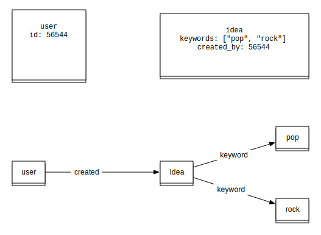

!SLIDE bullets incremental

# Breaking down the problem #

* Extract data
* Translate relationships
* Maintain it over time

!SLIDE 

# Extracting data #

!SLIDE

# &#9829; CouchDB #

!SLIDE bullets incremental

# Changes API #

* Allows all modified documents to be accessed
* With or without the document data
* Used by Elasticsearch
* Keyed on simple sequence number

!SLIDE bullets

# Event or Cron? #

* For operational simplicity we simply poll the changes API via cron

!SLIDE bullets

# Couch data expansion #

* A document is roughly the size of its data
* Generating many versions of the document rapidly bloats the database
* Our job scheduling data is seven times the size of our most active Wazoku

!SLIDE bullets

# Snapshot data #

* As we do not care about historic data
* We only want to know the last time something was successful
* We have switched to a standard key-value store (Redis)

!SLIDE bullets

# From document to graph #

* The document id is unique and becomes an indexed value in Neo4J
* Relationships are created according to the existence of keys holding arrays

!SLIDE center

!SLIDE bullets small

# Time is the enemy #

* Some relationships are permanent
* An interaction between two users, such as sharing
* A lot are transient, or user-managed
* Adding relationships is much easier than removing them