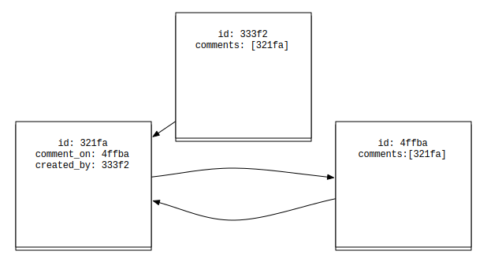
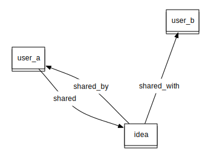
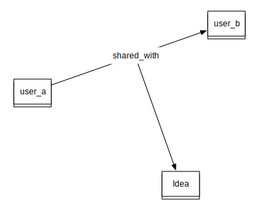

!SLIDE

# Lessons learned #

!SLIDE

# When stores collide #

!SLIDE bullets

# What we like to believe #

* A single store creates a reliable single point of truth

!SLIDE bullets

# The world is flat #

* As long as you are small and close to the ground

!SLIDE bullets

# Multiple stores, multiple truths #

* Resolving conflicts is a serious concern
* Having Couch at the heart of the system simplifies things for us

!SLIDE bullets

# Trust in Couch #

* Try and provide the tools for users to correct mistakes

!SLIDE bullets

# More generally #

* You have to have a strategy for resolving conflict
* Trying again is always valid!

!SLIDE 

# Context switching #

!SLIDE bullets

# Switching between stores #

* Mental models for the different stores often get conflated
* Making things harder than they need to be

!SLIDE center

!SLIDE center

!SLIDE center

!SLIDE bullets

# Avoiding switching #

* Implement in discrete units
* Provide external interfaces
* Create flows of work that maximise time spent in a store
